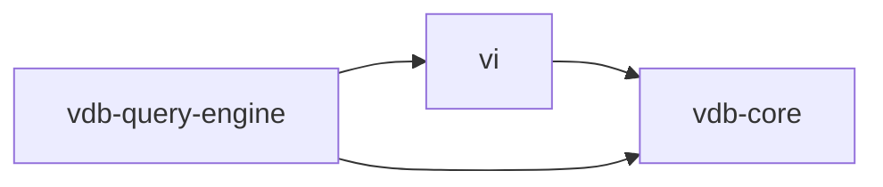

# Verun System Architecture

## Overview
Verun is a modular system combining a lightweight database (VDB) and a scriptable runtime (VI). It is designed for high performance and flexibility, with strict separation of concerns to avoid circular dependencies. This document outlines the architectural organization, module responsibilities, and interaction patterns.

---

## Module Structure

### 1. **`vdb-core` (Database Engine)**
#### Responsibilities
- **Low-Level Storage**  
  - Document storage (CRUD operations: `insert`, `find`, `update`, `delete`).  
  - Index management and schema validation.  
  - Transaction handling and connection pooling.  
  - BSON-backed internal persistence under `verun/vdb/__data__`.  
- **Data Representation**  
  - Works with native Java types (`Map<String, Object>`, `List`, primitives).  
  - Avoids JSON parsing except for I/O boundaries (e.g., HTTP APIs).  

#### Key Components
- `DocumentStore`: Core interface for collection-level operations.  
- `IndexManager`: Handles indexing strategies (B-tree, hash).  
- `StorageEngine`: Implementation for disk-based storage.  

---

### 2. **`vdb-query-engine` (Query & Script Orchestration)**
#### Responsibilities
- **Query Execution**  
  - Parses and executes complex queries (e.g., aggregation pipelines).  
  - Merges results from scripts and raw database operations.  
- **Script Integration**  
  - Invokes VI runtime to execute `.versa` scripts.  
  - Manages script context (e.g., variables, database handles).  
- **Result Formatting**  
  - Converts results to JSON-shaped API/CLI output while VDB keeps BSON-backed internal storage.  

#### Key Components
- `QueryParser`: Translates VQL (Verun Query Language) to executable plans.  
- `ScriptOrchestrator`: Coordinates script execution via VI.  
- `ResultAggregator`: Combines script output with raw DB results.  

---

### 3. **`vi` (Versa Interpreter)**
#### Responsibilities
- **Script Execution**  
  - Parses and executes `.versa` scripts.  
  - Provides runtime environment (variables, functions, error handling).  
- **Database Integration**  
  - Uses `vdb-core` for storage operations.  
  - Exposes a clean API for `vdb-query-engine` to invoke scripts.  

#### Key Components
- `Parser/Lexer`: Converts scripts to AST.  
- `Evaluator`: Executes AST with access to `vdb-core` APIs.  
- `RuntimeContext`: Manages script state (e.g., variables, DB connections).  

---

## Dependency Graph



---

## Key Design Principles

### 1. **Decoupling**
- `vdb-core` has **no knowledge** of `vi` or `vdb-query-engine`.  
- `vi` only interacts with `vdb-core` via its public Java API (no JSON/BSON).  

### 2. **Performance**
- **Native Types**: `vdb-core` avoids serialization overhead by using Java primitives.  
- **Script Caching**: `vi` caches compiled ASTs for frequently used scripts.  

---

## Data Flow
1. **Query Execution**  
   ```plaintext
   CLI/API → vdb-query-engine → QueryParser → ScriptOrchestrator → vi → vdb-core
   ```  
2. **Script Execution**  
   ```plaintext
   vi → vdb-core (for storage) → ResultAggregator → JSON/BSON output
   ```

---

## Example API Contracts

### `vdb-core` Interface
```java
public interface DocumentStore {
    void insert(String collection, Map<String, Object> document);
    List<Map<String, Object>> find(String collection, Bson filter);
    void update(String collection, Bson filter, Map<String, Object> updates);
    void delete(String collection, Bson filter);
}
```

### `vi` Script Execution API
```java
public class ScriptRuntime {
    public Object execute(String scriptCode, Map<String, Object> context) {
        // Parses script, injects context, and returns result
    }
}
```

---

## Performance Considerations
- **Minimal Serialization**: `vdb-core` and `vi` exchange data as Java objects.  
- **Bulk Operations**: `vdb-query-engine` batches script executions where possible.  
- **Indexed Scripts**: Frequently used scripts are precompiled and cached.  

---

## Development Guidelines
1. **Module Isolation**  
   - Never introduce `vi` dependencies in `vdb-core`.  
2. **Testing**  
   - `vdb-core` tests focus on storage correctness.  
   - `vdb-query-engine` tests validate script/query integration.  
3. **Dependency Management**  
   - Use Maven/Gradle to enforce module boundaries.  

---

## Future Directions
- **Distributed Queries**: Extend `vdb-query-engine` to shard scripts across nodes.  
- **JIT Compilation**: Enhance `vi` with GraalVM for faster script execution.  

---

_Last Updated: [17/03/2025]_ &copy; Zulan | Developed by [Bwalya Cameron Chishimba (Zulan)](https://zulan.io/folio/verun)
